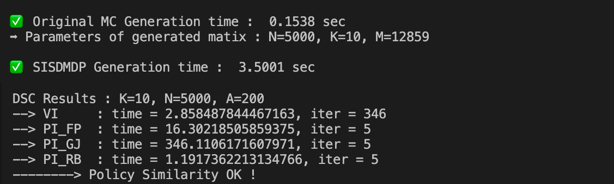
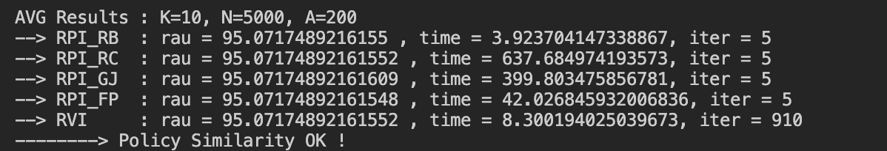
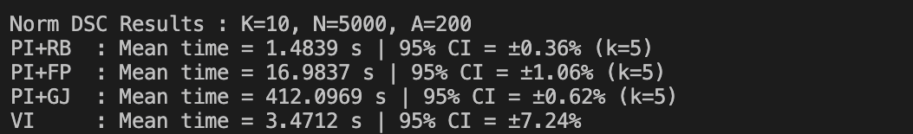
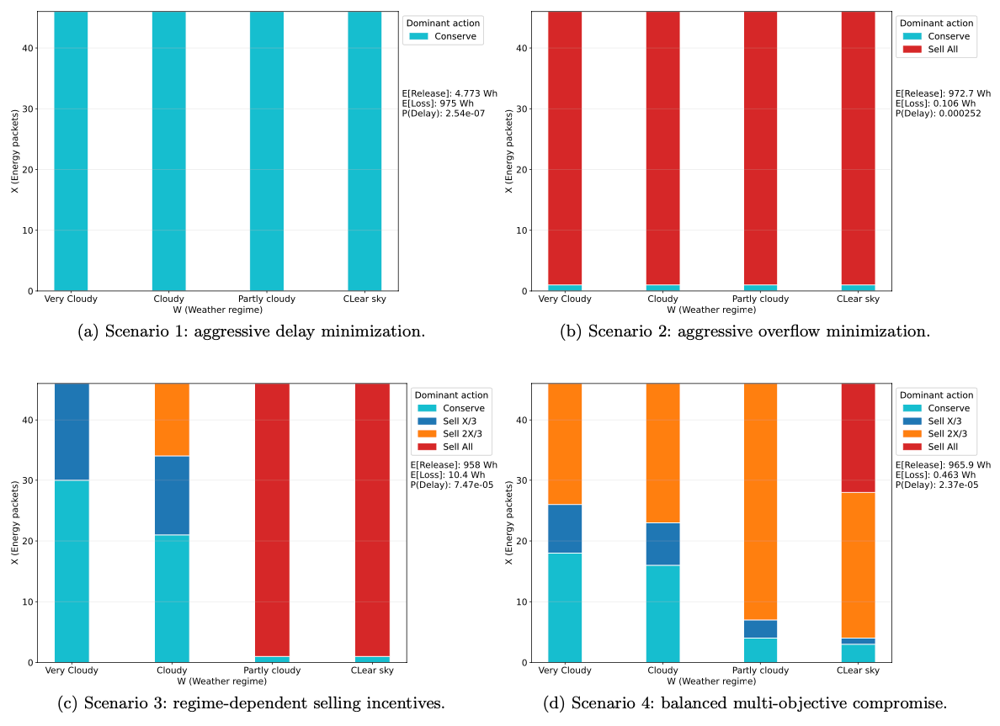
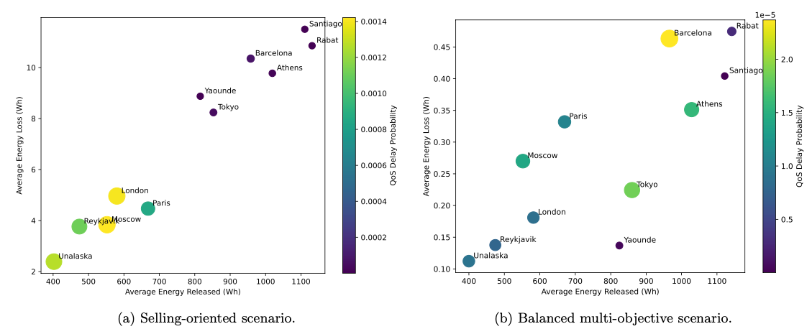
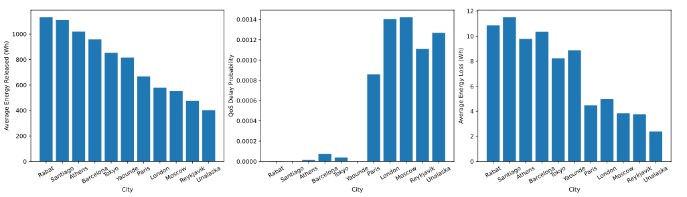
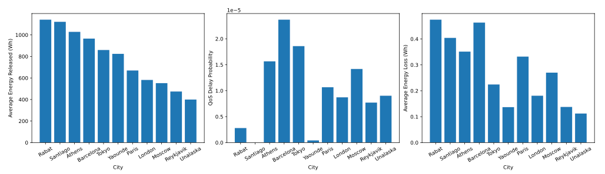

# SISDMDP framework

## I - Goal

This framework provides an efficient method for computing the optimal policy in structure-based Markov Decision Processes (MDPs), focusing on a class of problems we define as SISDMDPs (Single-Input Superstate Decomposable MDPs), introduced in [1].

It supports both average and discounted reward criteria, as well as CSR sparse models. The SISDMDP framework generalizes the structured models analyzed in previous work (<a href="https://github.com/ossef/MDP_Battery" target="_blank">MDP_Battery</a>), offering a scalable solution suitable for large-scale decomposable decision-making problems.

The proposed solution method is applied to a data-driven (<a href="https://pvwatts.nlr.gov/" target="_blank">NREL</a>) PhotoVoltaic energy storage application that optimizes several rewards (energy release, QoS delay, and energy loss) [2]. It provides a detailed analysis of the optimal policy and compares optimal performance metrics across different cities with distinct meteorological profiles.


## II - Project architecture

Tree of the most important files and folders in the project :

```
/
├─┬─Models/: Stores all Battery SISDMDP models
│ ├─── Toy_example_Model/   # A small toy example for the Battery SISDMDP model. Used for visual representation of kernel transition graph.
│ └─┬─ SIMPA_Journal_Model/ # A realistic NREL data-driven SISDMDP, generated with Xborne.
│   ├─-NREL_Data            # Raw NREL data for different locations (Rabat, Paris, Barcelona, Moscow, Unalaska ...)
│   ├─-NREL_Extracts        # Extracted discretized distributions from 'NREL_Data' for each city (run 'Dist_gener.py' file)
│   ├─-NREL_Models          # The Xborne generated SISDMDP models that uses 'NREL_Extracts' distributions (run 'scriptMDP' file)
│   └─-Dist_gener.py        # Code that transforms raw data from 'NREL_Data' into distributions in 'NREL_Extracts', making it usable by 'scriptMDP'
│                             in 'NREL_Models'
│
├─┬─Solve_SISDMDP/: Contains the source code for the SISDMDP solving
│ ├── generate_matrix.py        # Generating a SISDMC-SC structured Markov chain to use in "Launcher.py"
│ ├── gth_full.py               # GTH algorithm: steady-state probability distribution
│ ├── chiu_classic.py           # Feinberg & Chiu algorithm: for steady-state probability distribution
│ ├── chiu_ROB.py               # Proposed algorithm (Chiu + Rob-B): for steady-state probability distribution
│ ├─- Graph.py                  # Reads ".Rii" matrix storage from '/Models' folder, convert to sparse_row
│ ├── Solve_AVG_DSC_Reward.py   # Solving MDPs: average reward (5 algorithms) and discounted reward (4 algorithms)
│ │                             # The proposed algorithms are: MRPI + Chiu, MRPI + Chiu+ RobB, and PI + Chiu+ RobB
│ └──Launcher.py                # Script to run the experiments :
│                                 A) Tests scalability of the proposed algorithms on several synthetic SISDMDPs. 
│                                 B) Reads the NREL data-driven Xborne SISDMDP model (from '../Models/SIMPA_Journal_Model/NREL_Models/')
│                                 C) Solves the NREL data-driven Xborne SISDMDP model
│                                 D) Plots results in "../Results/" folder
├─── Results/: 
│       ├─- HeatMaps    # Detailled optimal policy for each state and thershold policy visualisation. 
│       └──Barplots     # Optimal average measures (energy storage, Delay probability, energy loss) and trade-off analysis for different locations.
│                         (It includes scatter figures).
│
├───ScreenShots/        # Contains some screenshots for below explanations
└───README.md           # Framework description and instructions
```

## III - Usage 
- All Markov Decision Process (MDP) algorithms are implemented in `Solve_AVG_DSC_Reward.py`
- Markov chain algorithms are implemented in `gth_full.py`, `chiu_classic.py`, and `chiu_ROB.py`
- The main launching file is `Launcher.py`, it contains:
    - test_algorithms():
        - Generates a synthetic SISDMDP model using the helper function from `generate_matrix.py`, based on the following parameters :
            - N: number of states
            - K: number of paritions
            - |A|: number of actions
        - Executes several algorithms:
            - Up to 5 Average Reward algorithms
            - Up to 4 Discounted Reward algorithms
        - Outputs:
            - Execution time
            - Number of iterations
            - Average reward (for average criteria)
            - Comparison of optimal policies
        - You can comment/uncomment specific algorithms in the code to customize the test
    - test_confidence_interval_normalized(n_runs):
        - Repeats the test_algorithms() process n_runs times to obtain a 95% confidence interval.
    - analyze_PV_Model():
      - Reads the data-driven SISDMDP model (stored in `/Models/SIMPA_Journal_Model/NREL_Model/`)
      - Solves the model and extracts the optimal policy
      - Computes and plots average optimal measures, either focusing and details on a single city (ANALYZE=1) or comparing results for different cities (ANALYZE=2).
      

## IV - Scalability testing of algorithms: 

Results of ($|A|=200$, $N=5000$, $K=10$) configuration: 
- In Discounted $(\gamma=0.9)$ reward, with `test_algorithms()` function: 
<br>
<div align="center">
    
</div>
<br>

- In Average reward, with `test_algorithms()` function: 
<br>
<div align="center">
    
</div>
<br>

- In Discounted $(\gamma=0.9)$ reward, with `test_confidence_interval_normalized(n_runs=30)` function: <br>
(Each algorithm is run 30 times)
<br>
<div align="center">
    
</div>
<br>

## V - Data-driven PV energy storage application: 
The formal description of the data-driven SISDMDP model is described in [2]. To run the application we will have to preprocess PhotoVoltaic energy production of Raw data (`/Models/SIMPA_Journal_Model/NREL_Data`). 

### Data-driven SISDMDP generation and solving

1) Execute the python code 'Dist_gener.py' in `/Models/SIMPA_Journal_Model/`: this code tranforms the Raw data of each city to discrete units energy distribution for each hour of the day, clustered by four wheater regimes (Very cloudy, Cloudy, Partly cloudy, Clear sky). After execution one can find the distributions in `/Models/SIMPA_Journal_Model/NREL_Extracts`. To test different scenarios, one can modify parameters in header part as Packets size and active hours interval. The average execution time (in a classical M1 laptop) of this script is 80 seconds, that inlcudes distributions generations of 11 cities model.

2) Execute 'scriptMDP' file in `/Models/SIMPA_Journal_Model/NREL_Model`: this script generates actions (generActions.py) then uses the C code of Xborne framework to generate the data-driven SISDMDP based on distributions in `/Models/SIMPA_Journal_Model/NREL_Extracts`. After running, the ready to solve models are therefore stored in `/Models/SIMPA_Journal_Model/NREL_Model` in cities named folders. Here, we only give models of 'Athens' an 'Barcelona' due to GitHub size limitations (the complete project is of size 20 Go). To test different scenarios, one can modify the Buffersize or actions generations file. However, to alter the kernel structure of the MDP, manipulation of Xborne is required, particularly with 'fun.c' file, which encodes the structure of a Markov Chain, including the description of states, various events, transitions, and their probabilities. The average execution time of this script is 5 minutes, that inlcudes the generation of 11 cities SISDMDP model, where each model contains 56 actions, each action describe a probabilistic matrix of about N=45000 states and 250000 arcs, and 184 superstates.

3) Now that `/Models/SIMPA_Journal_Model/NREL_Model` is ready, we can run two types of experiments in 'analyze_PV_Model()' function of  `/Solve_SISDMDP/Launcher.py` file. First, specify the rewards variables r1_by_M (Energy Packet release), r2 (EP-Energy Packet loss penalty), r3 (DP-Data Packets delay) then :
   - ANALYZE = 1 : fixe the name of a SISDMDP city model and run `Launcher.py` file. The detailled results of the optimal policy will be stored in `/Results/HeatMaps/` folder.
   - ANALYZE = 2 : specify the name of cities you want to compare, then run `Launcher.py` file. The detailled results of average measures will be stored in `/Results/Barplots/` folder.

### Data-driven SISDMDP execution and results
For instance when running the four scenarios (Section 7.2 in [2]) :
- Agressive DP delay minimization       : r1_by_M= [0,0,0,0],         r2= 0,    r3= -1000
- Agressive EP overflow minimization    : r1_by_M= [0,0,0,0],         r2= -0.5, r3= 0
- Regime dependent EP selling           : r1_by_M= [0.2,0.4,0.6,0.8], r2= 0,    r3= 0
- Balanced Multi-Objective Optimization : r1_by_M= [0.2,0.4,0.6,0.8], r2= -0.5, r3= -1000

We obtain using the experiment "ANALYZE=1" in Barcelona, the threshold optimal policy:
<div align="center">
    
</div>
along with another heatmap pdf file.
<br>
While Using the experiment "ANALYZE=2" on two last scenarios for different cities, we obtain the following trade-off visualization of released energy, overflow loss, and QoS delay probability:
<div align="center">
    
</div>
along with detailled barplots for "Regime dependent EP selling"  scenario:
<div align="center">
    
</div>
and "Balanced Multi-Objective Optimization" scenario:
<div align="center">
    
</div>

##  Contributors
- [Youssef AIT EL MAHJOUB](https://github.com/ossef)
- [Salma Alouah](https://github.com/salouah003)

Preliminary article [1]: <br>"Efficient Solving of Large Single Input Superstate Decomposable Markovian Decision Process". Youssef AIT EL MAHJOUB, Jean-Michel FOURNEAU and Salma ALOUAH. Pre-print, https://arxiv.org/abs/2508.00816. 2025.

In review article [2]: <br>"Efficient Solving of Large Single Input Superstate Decomposable Markovian Decision Process with Application to Photovoltaic Energy Storage". Youssef AIT EL MAHJOUB, Jean-Michel FOURNEAU and Salma ALOUAH. 2026.

Some related works: <br> 
https://doi.org/10.1016/j.comcom.2025.108273<br>
https://ieeexplore.ieee.org/abstract/document/10770514/ <br>
https://www.researchgate.net/publication/331334323_A_numerical_approach_of_the_analysis_of_optical_container_filling <br>
https://www.researchgate.net/publication/329954281_Performance_and_energy_efficiency_analysis_in_NGREEN_optical_network 


